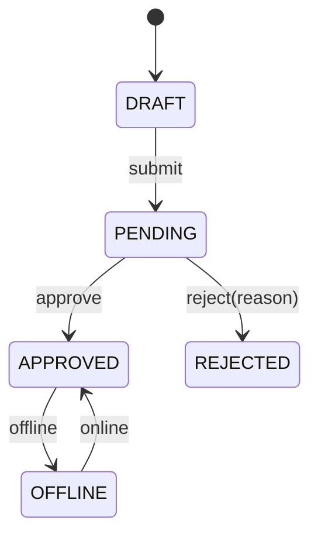
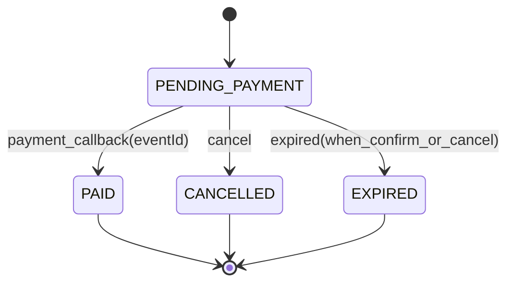
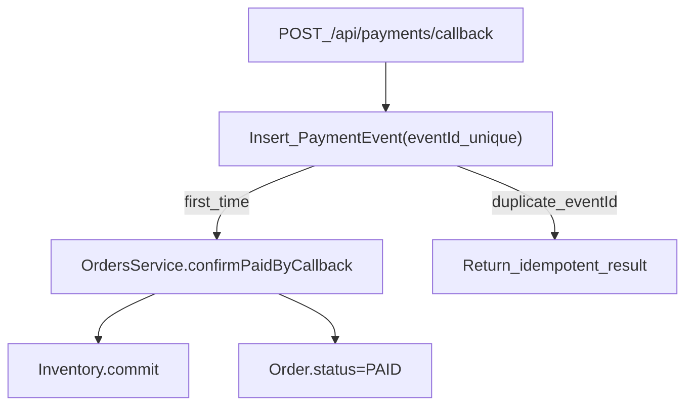

# 易宿酒店管理系统：架构与关键设计

本文聚焦关键设计：模块边界、状态机、实时链路与权限模型。代码以 `hotel-management/` 为准。

## 总体架构

```mermaid
flowchart TD
  AdminFE["AdminFrontend(React)"] -->|REST| Backend[NestJSBackend]
  MobileFE["PublicClient(Taro/H5)"] -->|REST| Backend
  Backend --> DB[(PostgreSQL/SQLite)]
  Backend -->|SSE| SSE[PriceUpdatesStream]
  Backend -->|WS(/notifications)| WS[SocketIONotifications]
```

## 模块划分（后端）

- **Auth**：JWT 登录态 + `RolesGuard` 做 RBAC（商户/管理员隔离）。
- **Hotels**：酒店 CRUD、审核状态流转、公开查询（仅已发布）。
- **Admin**：管理员审核入口（approve/reject/offline/online）。
- **Notifications**：Socket.IO 网关 + 通知持久化（支持用户级与角色级推送）。
- **PriceUpdates**：SSE 价格/状态变化事件流（`/api/public/hotels/price-updates`）。
- **Orders**：用户端下单/取消/查询，订单状态机与超时过期（关键路径“懒过期”）。
- **Inventory**：按 `roomTypeId + date` 的日历库存（`total/reserved/sold`），通过事务化 reserve/commit/release 防超卖。
- **Payments**：模拟支付回调入口 + 幂等事件表（`eventId` 唯一约束）驱动订单确认支付。

## 审核状态机（服务端强约束）

状态校验在 `HotelsService` 中完成（非法状态直接 `ForbiddenException`），避免前端绕过。



## 实时链路设计

### 1) SSE：公开端“变更事件流”

- **入口**：`GET /api/public/hotels/price-updates`（SSE）
- **事件**：`price_changed / hotel_updated / hotel_online / hotel_offline / hotel_hidden / keepalive`
- **触发点**：审核通过、上下线等状态变化会 `emit` 对应事件，公开端可据此刷新列表/详情缓存。

### 2) WebSocket：管理端“操作结果通知”

- **namespace**：`/notifications`
- **路由策略**：
  - `user:{userId}`：精准推送 + 落库（用于未读通知列表）
  - `role:{role}`：角色广播 +（按角色为每个用户落库）
- **典型消息**：审核通过/驳回、上下线等（包含 `hotelId/hotelName/timestamp`）

## 权限模型（最小可用 RBAC）

- **管理员接口**：`@UseGuards(AuthGuard('jwt'), RolesGuard)` + `@Roles(ADMIN)`
- **商户接口**：按 `merchantId` 做所有权校验；`PENDING` 状态禁止修改，避免“审核中被篡改”。

### 输入校验与安全边界

- **输入校验**：所有对外 DTO（注册、登录、创建/更新酒店、创建订单、支付回调等）均通过 `class-validator` + `ValidationPipe` 做白名单校验：
  - 基本规则：非空、长度、枚举、数值范围、日期格式（如 `IsDateString`）
  - 安全规则：密码复杂度（包含数字+字母）、ID 必须为正整数，防止“构造异常 ID / 超长字符串”击穿后端
- **防 SQL 注入**：所有数据库访问均通过 TypeORM 的参数化查询完成，不直接拼接用户输入到 SQL 中。
- **越权与所有权校验**：
  - 酒店/房型：按 `merchantId` 校验操作对象是否属于当前商户
  - 订单：按 `userId` 限制仅能操作自己的订单，且仅允许对 `PENDING_PAYMENT` 做取消
- **前端 XSS 防护**：管理端与客户端统一使用 React 渲染，不在用户可控字段上使用 `dangerouslySetInnerHTML`，仅在受信任内容（如后台富文本）中按白名单开启。

### 审计日志：谁在什么时候对什么做了什么

- **审计表结构**：`AuditLog(action, actorType, actorId, targetType, targetId, payload, createdAt)`
- **记录范围**（示例）：
  - 管理员审核通过/驳回酒店：`hotel_approved / hotel_rejected`
  - 酒店上下线：`hotel_offline / hotel_online`
- **使用方式**：
  - 在 `AdminController` 中注入 `AuditService`，在审核/上下线等敏感操作完成后写入审计记录
  - 可用于排查“误操作/恶意操作”，也可作为运营侧的行为追踪基础

## 预订闭环：防超卖 + 状态机 + 支付幂等

### 1) 角色与边界

- **merchant/admin**：沿用原有管理端边界。
- **customer**：仅访问订单相关接口（`/api/orders/**`），用于模拟真实“用户下单”场景。

### 2) 订单状态机（服务端强约束）



- **设计取舍**：不引入定时任务队列，改用“关键路径懒过期”（在 `cancel/confirmPaid` 时判断 `expiresAt`），保证演示与测试可控、逻辑可讲清。

### 3) 防超卖：日历库存 + 事务化变更

- **表结构**：`RoomInventory(roomTypeId, date, total, reserved, sold)`，并对 `(roomTypeId, date)` 建唯一约束。
- **核心不变量**：`reserved + sold <= total`。\n
- **流程**：\n
  - **下单**：`reserve`（校验可用 → `reserved += rooms`）\n
  - **支付成功**：`commit`（`reserved -= rooms` 且 `sold += rooms`）\n
  - **取消/过期**：`release`（`reserved -= rooms`）\n
- **并发正确性**：在 PostgreSQL 下对库存行使用写锁（pessimistic lock）确保并发扣减不会超卖；SQLite 下依赖事务串行写入特性保持一致性。

### 4) 支付回调幂等：事件表 + 唯一约束



- **幂等点**：`PaymentEvent.eventId` 唯一索引，重复回调不触发二次扣库存/二次状态迁移。\n
- **乱序安全**：若订单已处于终态（`PAID/CANCELLED/EXPIRED`），回调只落事件并标记 `IGNORED`。

## 可观测性与健康检查（排障友好）

### 1) 指标与结构化日志

- **Prometheus 指标**：基于 `prom-client` 暴露 `/metrics` 接口，注册默认进程指标，并增加：
  - `http_requests_total{method,route,status_code}`：HTTP 请求总数
  - `http_request_duration_ms_bucket{...}`：按耗时分桶的请求耗时直方图
- **日志拦截器**：全局 `LoggingInterceptor` 在请求完成后输出一条结构化日志：
  - 字段：`requestId/method/route/originalUrl/statusCode/durationMs/timestamp`
  - 形态：一行 JSON，便于后续接入 ELK / Loki 等集中日志系统
- **请求上下文中间件**：`RequestContextMiddleware` 负责：
  - 从 `x-request-id` 头透传或生成 `requestId`，写回响应头
  - 记录请求开始时间，为耗时计算与日志/指标复用

> 如何从一条告警（例如「订单接口 P95 > 2s」）追到具体请求 / SQL：告警 → `/metrics` → 日志中的 `requestId` → 结合业务字段（`orderId/roomTypeId`）做问题归因。

### 2) 健康检查与运行状态

- **健康检查接口**：`GET /healthz`
  - 行为：对主数据库执行一次 `SELECT 1`，记录响应时间
  - 返回示例：
    - `status: "ok"`
    - `checks.db.status: "up"`
    - `checks.db.responseTimeMs: number`
    - `timestamp: ISO string`
- **容器/编排集成**：可直接将 `/healthz` 用作 Kubernetes / 容器平台的 `livenessProbe` / `readinessProbe` 入口。

### 3) 配置分层（APP_ENV）

- 通过环境变量区分不同环境配置：
  - `APP_ENV=dev/staging/prod`：业务级环境标识
  - `NODE_ENV=development/production`：运行时优化标识
- 在配置模块中集中管理：
  - 数据库：类型（`postgres/sqlite`）、连接串、连接池
  - 安全：`JWT_SECRET/JWT_EXPIRES_IN`
  - 实时链路：SSE keepalive 间隔、WebSocket 命名空间
  - 可观测性：是否开启 debug 日志 / SQL logging

> 如何在「本地开发 / 预发布 / 线上」之间切换配置；如何通过 `/healthz` + `/metrics` 快速判断是「依赖挂了」还是「某个接口慢了」。
