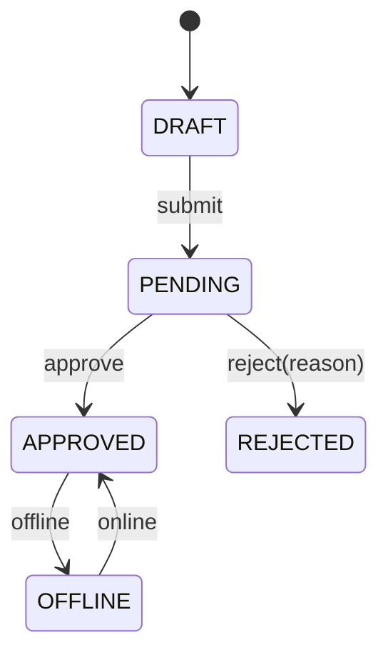
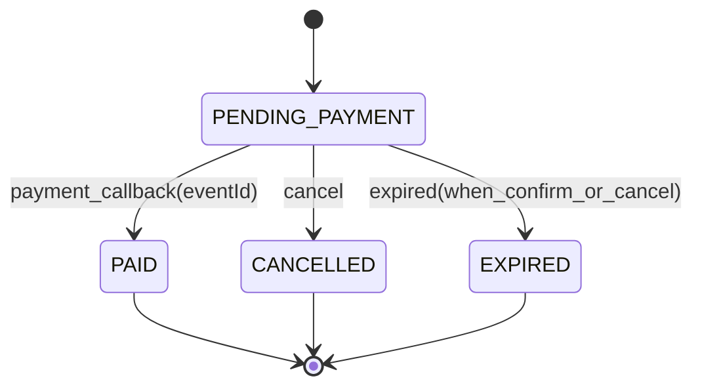
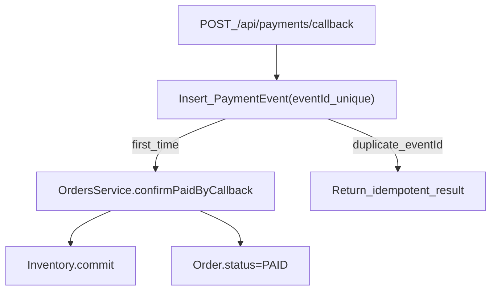

# 易宿酒店管理系统：架构与关键设计

本文聚焦“面试可讲清楚”的关键设计：模块边界、状态机、实时链路与权限模型。代码以 `hotel-management/` 为准。

## 总体架构

```mermaid
flowchart TD
  AdminFE["AdminFrontend(React)"] -->|REST| Backend[NestJSBackend]
  MobileFE["PublicClient(Taro/H5)"] -->|REST| Backend
  Backend --> DB[(PostgreSQL/SQLite)]
  Backend -->|SSE| SSE[PriceUpdatesStream]
  Backend -->|WS(/notifications)| WS[SocketIONotifications]
```

## 模块划分（后端）

- **Auth**：JWT 登录态 + `RolesGuard` 做 RBAC（商户/管理员隔离）。
- **Hotels**：酒店 CRUD、审核状态流转、公开查询（仅已发布）。
- **Admin**：管理员审核入口（approve/reject/offline/online）。
- **Notifications**：Socket.IO 网关 + 通知持久化（支持用户级与角色级推送）。
- **PriceUpdates**：SSE 价格/状态变化事件流（`/api/public/hotels/price-updates`）。
- **Orders**：用户端下单/取消/查询，订单状态机与超时过期（关键路径“懒过期”）。
- **Inventory**：按 `roomTypeId + date` 的日历库存（`total/reserved/sold`），通过事务化 reserve/commit/release 防超卖。
- **Payments**：模拟支付回调入口 + 幂等事件表（`eventId` 唯一约束）驱动订单确认支付。

## 审核状态机（服务端强约束）

状态校验在 `HotelsService` 中完成（非法状态直接 `ForbiddenException`），避免前端绕过。



## 实时链路设计

### 1) SSE：公开端“变更事件流”

- **入口**：`GET /api/public/hotels/price-updates`（SSE）
- **事件**：`price_changed / hotel_updated / hotel_online / hotel_offline / hotel_hidden / keepalive`
- **触发点**：审核通过、上下线等状态变化会 `emit` 对应事件，公开端可据此刷新列表/详情缓存。

### 2) WebSocket：管理端“操作结果通知”

- **namespace**：`/notifications`
- **路由策略**：
  - `user:{userId}`：精准推送 + 落库（用于未读通知列表）
  - `role:{role}`：角色广播 +（按角色为每个用户落库）
- **典型消息**：审核通过/驳回、上下线等（包含 `hotelId/hotelName/timestamp`）

## 权限模型（最小可用 RBAC）

- **管理员接口**：`@UseGuards(AuthGuard('jwt'), RolesGuard)` + `@Roles(ADMIN)`
- **商户接口**：按 `merchantId` 做所有权校验；`PENDING` 状态禁止修改，避免“审核中被篡改”。

## 预订闭环：防超卖 + 状态机 + 支付幂等（面试加分点）

### 1) 角色与边界

- **merchant/admin**：沿用原有管理端边界。
- **customer**：仅访问订单相关接口（`/api/orders/**`），用于模拟真实“用户下单”场景。

### 2) 订单状态机（服务端强约束）



- **设计取舍**：不引入定时任务队列，改用“关键路径懒过期”（在 `cancel/confirmPaid` 时判断 `expiresAt`），保证演示与测试可控、逻辑可讲清。

### 3) 防超卖：日历库存 + 事务化变更

- **表结构**：`RoomInventory(roomTypeId, date, total, reserved, sold)`，并对 `(roomTypeId, date)` 建唯一约束。
- **核心不变量**：`reserved + sold <= total`。\n
- **流程**：\n
  - **下单**：`reserve`（校验可用 → `reserved += rooms`）\n
  - **支付成功**：`commit`（`reserved -= rooms` 且 `sold += rooms`）\n
  - **取消/过期**：`release`（`reserved -= rooms`）\n
- **并发正确性**：在 PostgreSQL 下对库存行使用写锁（pessimistic lock）确保并发扣减不会超卖；SQLite 下依赖事务串行写入特性保持一致性。

### 4) 支付回调幂等：事件表 + 唯一约束



- **幂等点**：`PaymentEvent.eventId` 唯一索引，重复回调不触发二次扣库存/二次状态迁移。\n
- **乱序安全**：若订单已处于终态（`PAID/CANCELLED/EXPIRED`），回调只落事件并标记 `IGNORED`。

